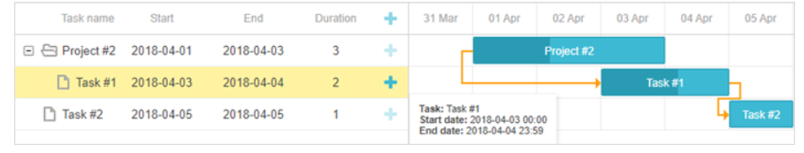

### 设定工作时间表

有三种方法可以为数据Feed中的任务定义时间表：
  		1. start_date + duration
    		2. start date + end_date
      		3. duration + end_date

未指定的属性将根据数据对象中定义的属性进行计算。

##### 格式化任务的结束日期

任务的结束日期不包括在内。这意味着Gantt会将范围内最新日期的午夜解释为任务的结束，而最新日期本身并未包含在任务工期中，因此也不会显示。例如，对于Gantt，原定于2018年5月20日（20-05-2018 00:00:00）进行的为期1天的任务将在21-05-2018 00:00:00结束，尽管5月21日，2018年将不属于此任务。

不可能影响存储数据的甘特格式。但是，您可以重新定义甘特图网格的模板，以使其仅显示包含日期。因此，甘特图会将任务的结束日期显示为*end_date-1，*而不是从代码中获取确切的“ end_date”值。

在下面的示例中，通过[tooltip_text](https://docs.dhtmlx.com/gantt/api__gantt_tooltip_text_template.html)模板重新定义了在工具提示中显示最终任务：

```js
function formatEndDate(date, template){ 
    // get 23:59:59 instead of 00:00:00 for the end date
    return template(new Date(date.valueOf() - 1));  
}
 
gantt.config.columns = [
    {name: "text", label: "Task name", tree: true, width: 160, resize:true},
    {name: "start_date", label:"Start", align: "center", width: 100, resize:true},
    {name: "end_date", label:"End", align: "center", width: 100, 
        template: function(task){
            return formatEndDate(task.end_date, gantt.templates.date_grid);
        }, resize:true},
    // more columns
];
 
gantt.init("gantt_here");
var formatFunc = gantt.date.date_to_str("%Y-%m-%d %H:%i");
gantt.templates.tooltip_text = function (start, end, task) {
     return "<b>Task:</b> " + task.text + "<br/><b>Start date:</b> " + 
       formatFunc(task.start_date) + "<br/><b>End date:</b> " + 
       formatEndDate(task.end_date, formatFunc);
};
```


