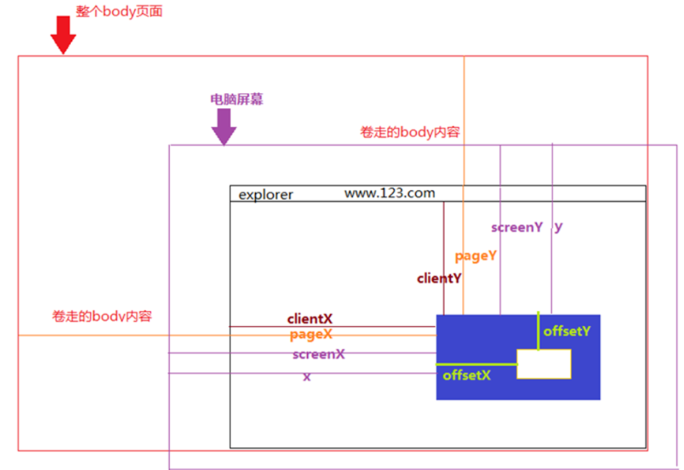

### [鼠标事件以及clientX、offsetX、screenX、pageX、x的区别](https://blog.csdn.net/weixin_41342585/article/details/80659736)

##### 一、clientX、clientY

点击位置距离当前body可视区域的x，y坐标

##### 二、pageX、pageY

对于整个页面来说，包括了被卷去的body部分的长度

##### 三、screenX、screenY

点击位置距离当前电脑屏幕的x，y坐标

##### 四、offsetX、offsetY

相对于带有定位的父盒子的x，y坐标

##### 五、x、y

和screenX、screenY一样   516520,2.64934e+006,1010.54,0.424708,-0.17592,-0.339851,0.820473


##### 获取select标签选中值

```js
         var obj = document.getElementById("speedChange"); //定位id
         var index = obj.selectedIndex; // 选中索引
         var speed = parseInt(obj.options[index].value); // 选中值
         console.log("倍速：" + speed);
```

#### 当select标签选中的option改变时，需要先cleatTimeOut

#### 监听浏览器窗口大小变化

```js
<script>
  export default {
    data() {
      return {
        screenWidth: '',
        screenHeight: ''
      };
    },
    mounted() {
      this.screenWidth = document.body.clientWidth;
      this.screenHeight = document.body.clientHeight;
      window.onresize = () => {
        return (() => {
          this.screenWidth = document.body.clientWidth;
          this.screenHeight = document.body.clientHeight;
        })();
      };
    }
  },
  //监听screenWidth属性值的变化
  watch:{
	screenWidth(val){
        //Done...
    }
</script>
```


#### 父组件

```vue
<template>
  <div class="moni">
    <slider :min="0" :max="1000" v-model="per"></slider>
  </div>
</template>
    <script>
import slider from "../components/shuzumoni/Slider";
export default {
  name: "moni",
  data() {
    return {
      per: 0,
    };
  },
  components: {
    slider,
  },
  methods: {
    perValue() {
      this.curValue = this.$children[0].scale * 1000;
      let value = this.curValue;
    },
  }
};
</script>
```

#### 子组件

```vue
<template>
  <div class="app">
    <div class="topSlider">
      <div class="slider" ref="slider" @click="sliderClick($event)">
        <div class="process" :style="{width}"></div>
        <div class="thunk" ref="trunk" :style="{left}">
          <div class="block"></div>
          <div class="tips">
            <span>{{curValue}}</span>
            <i class="fas fa-caret-down"></i>
          </div>
        </div>
      </div>
      <select name="account" id="speedChange" @change="gradeChange()">
        <option value="1">倍速：1X</option>
        <option value="2">倍速：2X</option>
        <option value="4">倍速：4X</option>
      </select>
      <div title="播放" :class="play==true?'tBtnDiv play':'tBtnDiv pause'" @click="playProgress"></div>
      <div title="停止" class="tBtnDiv" @click="stopProgress"></div>
    </div>
  </div>
</template>
<script>
/*
 * min 进度条最小值
 * max 进度条最大值
 * v-model 对当前值进行双向绑定实时显示拖拽进度
 * */
export default {
  props: ["min", "max", "value"],
  data() {
    return {
      slider: null, //滚动条DOM元素
      thunk: null, //拖拽DOM元素
      per: this.value, //当前值
      play: true, //播放 暂停
      time: [],
      curValue: 0,
      speed: 1, //倍速
      screenWidth: "",//当前窗口宽度
      screenHeight: "",//当前窗口的高度
      offsetWidth: 0, //进度条的长度
      offsetLeft: 0,//进度条距离左侧的长度
    };
  },
  //渲染到页面的时候
  mounted() {
    this.slider = this.$refs.slider;
    this.thunk = this.$refs.trunk;
    // 监听浏览器窗口大小变化
    this.screenWidth = document.body.clientWidth;
    this.screenHeight = document.body.clientHeight;
    window.onresize = () => {
      return (() => {
        this.screenWidth = document.body.clientWidth;
        this.screenHeight = document.body.clientHeight;
      })();
    };

    var _this = this;
    this.thunk.onmousedown = function(e) {
      var width = parseInt(_this.width);
      var disX = e.clientX;
      document.onmousemove = function(e) {
        // value, left, width
        // 当value变化的时候，会通过计算属性修改left，width

        // 拖拽的时候获取的新width
        var newWidth = e.clientX - disX + width;
        // 拖拽的时候得到新的百分比
        var scale = newWidth / _this.slider.offsetWidth;
        _this.per = Math.ceil((_this.max - _this.min) * scale + _this.min);
        _this.per = Math.max(_this.per, _this.min);
        _this.per = Math.min(_this.per, _this.max);
      };
      document.onmouseup = function() {
        document.onmousemove = document.onmouseup = null;
      };
      return false;
    };
  },
  computed: {
    // 设置一个百分比，提供计算slider进度宽度和trunk的left值
    // 对应公式为  当前值-最小值/最大值-最小值 = slider进度width / slider总width
    // trunk left =  slider进度width + trunk宽度/2
    //当前进度值
    scale() {
      return (this.per - this.min) / (this.max - this.min);
    },
    //当前进度条长度
    width() {
      if (this.slider) {
        return this.offsetWidth * this.scale + "px";
      } else {
        return 0 + "px";
      }
    },
    //当前可拖动进度块距离初始位置的值
    left() {
      if (this.slider) {
        return (
          this.offsetWidth * this.scale - this.thunk.offsetWidth / 2 + "px"
        );
      } else {
        return 0 + "px";
      }
    }
  },
  watch: {
    scale(newValue, oldValue) {
      let that = this;
      this.curValue = Math.ceil(newValue * that.max);
    },
    screenWidth(newValue, oldValue) {
      this.offsetWidth = this.$refs.slider.offsetWidth;
      this.offsetLeft = this.$refs.slider.offsetLeft;
    }
  },
  methods: {
    // 播放的进度（开始暂停）
    playProgress() {
      let that = this;
      if (that.play) {
        for (let i = 0; i < that.max; i++) {
          that.time[i] = setTimeout(function() {
            if (that.per < that.max) {
              that.per++;
            }
          }, (i * 400) / that.speed);
        }
        that.play = false;
      } else {
        that.play = true;
        that.clearTime();
      }
    },
    // 停止
    stopProgress() {
      this.per = 0;
      this.play = true;
      this.clearTime();
    },
    // 清除setTimeout
    clearTime() {
      let that = this;
      for (let j = 0; j < that.time.length; j++) {
        if (that.time[j] != undefined) {
          clearTimeout(that.time[j]);
        }
      }
    },
    sliderClick(e) {
      //计算点击位置占总长度的比例...
      let position =
        ((e.clientX - this.offsetLeft) / this.offsetWidth) * this.max;
      this.per = parseInt(position);
    },
    // 倍速改变时
    gradeChange() {
      var objS = document.getElementById("speedChange");
      var grade = parseInt(objS.options[objS.selectedIndex].value);
      this.speed = grade;
      this.clearTime();
      this.play = true;
      this.playProgress();
    }
  }
};
</script>
<style scoped>
.box {
  margin: 100px auto 0;
  width: 80%;
}
.clear:after {
  content: "";
  display: block;
  clear: both;
}
.topSlider {
  width: 100%;
  display: flex;
  align-items: center;
  justify-content: space-around;
}
.slider {
  position: relative;
  margin: 20px;
  width: 85%;
  height: 5px;
  background: #e4e7ed;
  border-radius: 5px;
  cursor: pointer;
}
.slider .process {
  position: absolute;
  left: 0;
  top: 0;
  width: 112px;
  height: 5px;
  border-radius: 5px;
  background: #409eff;
}
.slider .thunk {
  position: absolute;
  left: 100px;
  top: -5px;
  width: 20px;
  height: 20px;
}
.slider .block {
  width: 10px;
  height: 10px;
  border-radius: 50%;
  border: 2px solid #409eff;
  background: rgba(255, 255, 255, 1);
  transition: 0.2s all;
}
.slider .tips {
  position: absolute;
  left: -7px;
  bottom: 30px;
  min-width: 15px;
  text-align: center;
  padding: 4px 8px;
  background: #000;
  border-radius: 5px;
  height: 24px;
  color: #fff;
}
.slider .tips i {
  position: absolute;
  margin-left: -5px;
  left: 50%;
  bottom: -9px;
  font-size: 16px;
  color: #000;
}
.slider .block:hover {
  transform: scale(1.1);
  opacity: 0.6;
}
#speedChange {
  height: 20px;
}
.tBtnDiv {
  height: 25px;
  width: 25px;
  background-color: black;
}
.play {
  background-color: green;
}
.pause {
  background-color: red;
}
</style>
```


