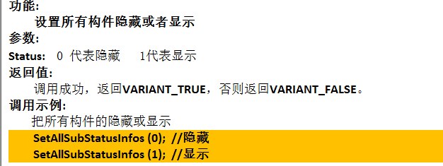

```html
<object
     id= "ebring_test"
     classid= "clsid:0E4613EE-4EF4-40CD-A2F9-CB7D50CF318E" align="center" style="width:100%;height:90%;">
    </object>
```

object标签用于包含对象，比如图像、音频、视频、Java applets、ActiveX、PDF以及Flash。
classid：classid 就是ActiveX控件的ID。定义嵌入WIndows Registry （注册表）中或者某个URL类的ID值，此属性可用来指定浏览器中包含的对象的位置，通常是一个Java类。

##### 加载场景

SwitchBIMSceneSimple方法：

```
objOcx.SwitchBIMSceneSimple("D:/dacheng_gl/","Resource_guangliantest");
```


##### 重置相机

Function_ResetCamera：
		1.通过getElementById获取object标签；
		2.调用ResetCamera方法（功能：重置相机位置到初始方位；	参数：无；	返回值：无）

```js
var objOcx=document.getElementById ("ebring_test");//获取DOM
objOcx.ResetCamera();//调用ResetCamera方法
```

##### 定位构件

Function_FocusCameraToComponent：
		1.通过getElementById获取object标签；
		2.调用ResetCamera方法（功能：定位构件；	参数：构件ID，；	返回值：无）


##### 获取相机位置

Function_GetCamLocation：

​		1.通过getElementById获取object标签；
​		2.调用GetCamLocation方法（功能：获取相机的方位；	参数：无；	返回值：当前相机的方位以及朝向，其中方位包括x、y、z三个值，朝向以四元数的形式展示，包含四个值）

```js
var objOcx=document.getElementById ("ebring_test"); //获取DOM
var cameralocation = document.getElementById("cameralocation")//input框
cameralocation.value = objOcx.GetCamLocation();//设置input框中的值为当前相机位置
//514822, 2.6484e+006, 2549.3, 0.424708, -0.17592, -0.339851, 0.820473
```

##### 设置所有构件颜色

Function_SetAllSubClrInfos：
		1.通过getElementById获取object标签；
		2.调用SetAllSubClrInfos方法


##### 显示/隐藏所有构件

SetAllSubStatusInfos1、SetAllSubStatusInfos：
		调用SetAllSubStatusInfos方法


##### 显示/隐藏部分组件

SetSubArrayStatusInfo1、SetSubArrayStatusInfo：

​		调用SetSubArrayStatusInfo方法


##### 设置构件颜色

SetSubArrayStatusInfo0：
		调用SetSubArrayClrInfo方法


##### 设置一批构件无效（可点击，不能使用各种方法，如闪烁、设置颜色等）

SetElementsInvalidByIds：
		调用SetElementsInvalidByIds方法：


##### 设置所有构件无效

SetAllElementsInvalid：
		调用SetAllElementsInvalid方法


##### 构件隔离


##### 模型隐藏

Function_SetSceHugeObjVisible：
		调用SetSceHugeObjVisible方法


### 闪烁

##### 闪烁准备

​	Function_SetSubObjFlickerBegin：
​		调用SetSubObjFlickerBegin方法


##### 添加闪烁构件

​	Function_AddFlickerSubObjects：
​		调用AddFlickerSubObjects方法


##### 闪烁

Function_SetSubObjFlickerEnd：
		调用SetSubObjFlickerEnd方法


##### 截屏

Function_CreateSnapShootInMem：
		调用CreateSnapShootInMem


```js
<script language="javascript"   for="ebring_test" EVENT="SnapShootData( PicBuf,  PicWidth,  PicHeight,  RenDataBuf ,Type)" type="text/javascript">
		alert(PicBuf);
</script>
```


##### 获取box ZoomToModel

Function_GetElementBox：
		调用GetHugeObjSubAABB方法


##### 提交输入

SubmitText_onclick：提交输入的标注文字内容

调用

##### 保存标注

SaveText_onclick：
		调用CreateMarkerEndInMem方法		


#### 还原标注

Function_LocateCamTo
		调用ShowSnapshotOrMarkerInMem方法


```js
objOcx.ShowSnapshotOrMarkerInMem(1,"-113.881,-79.0021,223.427,0.424708,-0.17592,-0.339851,0.820473|8_907,8_906|4,-88.3526,-27.4069,191.604,-91.683,-30.7373,184.943,-77.0716,-45.3487,184.943,-73.7412,-42.0183,191.604,-73.5236,-42.236,191.604,1,0,0,1|建筑");

```


#### 保存标记

SaveSymbol_onclick：提交标记内容
		调用AddSymbol方法


#### 结束添加

ExitSymbol_onclick：
		调用AddSymbolEnd方法


#### 点击构件

在script标签中添加EVENT事件：OnCurSelModelChanged

```html
<script language="javascript"  for="ebring_test" EVENT="OnCurSelModelChanged(strObjName, uFileID,uObjSubID,   fObjSelX, fObjSelY, fObjSelZ,  fObjBVMinX,fObjBVMinY,fObjBVMinZ,  fObjBVMaxX,fObjBVMaxY,fObjBVMaxZ)" type="text/javascript">
```


#### 添加标记

在script标签中添加EVENT事件：OnPickPosition

```html
<script language="javascript"  for="ebring_test" EVENT="OnPickPosition( fPosX,  fPosY,  fPosZ)" type="text/javascript">
```


当提交标记时调用SaveSymbol_onclick方法：

```js
function SaveSymbol_onclick() {
	var objOcx=document.getElementById ("ebring_test");
	var SymbolText = document.getElementById("AddSymbol");
	var SymbolName = document.getElementById("EleBox");
	console.log("SymbolText.value:"+SymbolText.value) //标记内容
			 		       objOcx.AddSymbol(SymbolName,SymbolText.value,sym_x,sym_y,sym_z,50.0,0);
}
```

点击结束添加时调用AddSymbolEnd方法

#### 删除标记

在script标签中添加EVENT事件：OnSymbolSelected

```html
<script language="javascript"  for="ebring_test" EVENT="OnSymbolSelected(SelSymbolName)" type="text/javascript">
		var objOcx=document.getElementById ("ebring_test");
		sym_name=SelSymbolName;
</script>
```

然后通过DeleteSymbol方法删除标记：需要将


#### 隐藏按钮

调用SetButtonVisible方法


#### 获取缩放比例，定位相机位置（一定时间内切换），闪动


## Vue中的相机定位

方法在SuperMap.js中，**flytoPoint**   其中在SuperMap.vue、LeftToolbar.vue中用到

